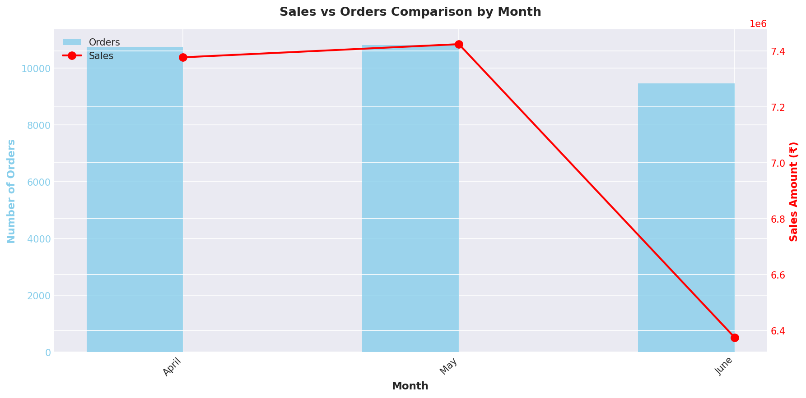
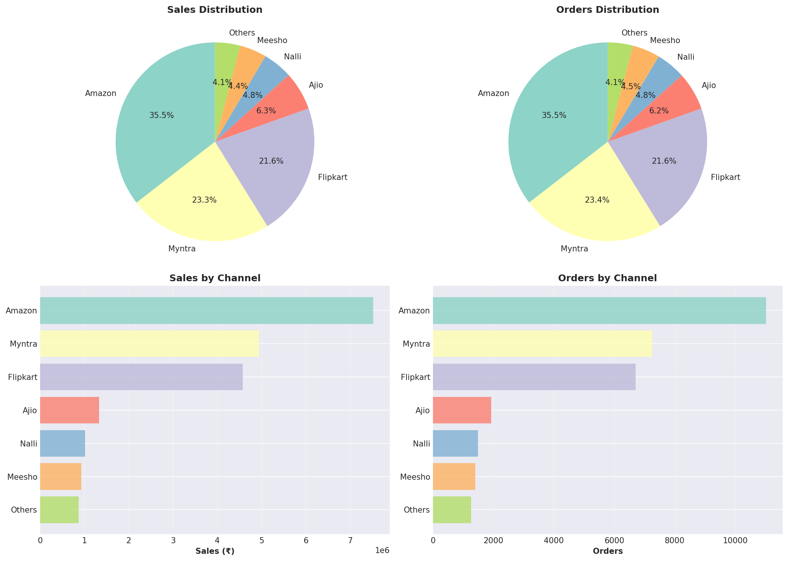
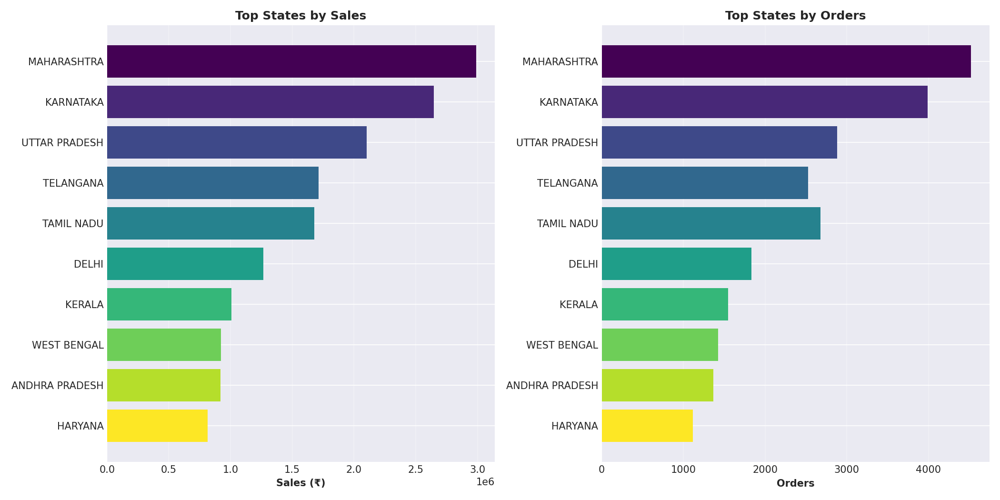
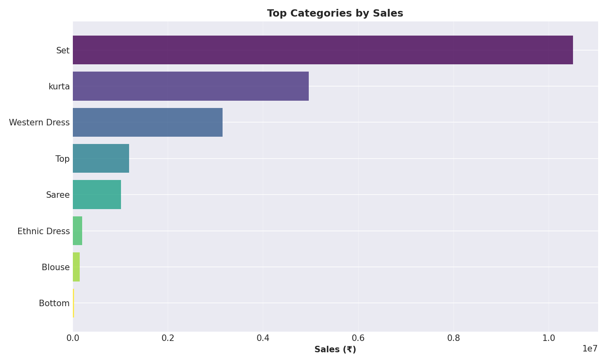

# 📊 Vrinda Store Sales Data Analysis

## 📌 Project Overview

This project performs end-to-end exploratory data analysis (EDA) on Vrinda Store sales data to uncover actionable business insights.

The goal of this analysis is to:
- Identify revenue trends
- Understand customer behavior
- Analyze sales channels performance
- Detect high-performing states and product categories
- Generate automated reports and visual insights

This project demonstrates practical data analytics workflow using Python.

---

## 🛠️ Tech Stack

- Python 3
- Pandas
- NumPy
- Matplotlib
- Seaborn
- OpenPyXL

---

## 📂 Project Structure

vrinda_analysis/ │ ├── data/                     # Raw dataset ├── scripts/                  # Analysis scripts │   └── vrinda_analysis.py ├── output/                   # Generated visualizations & reports ├── requirements.txt          # Project dependencies └── README.md

---

## 🔎 Key Business Questions Answered

1. 📈 How do sales and orders compare monthly?
2. 🗓️ Which month generated the highest revenue?
3. 👩‍🦰 What is the gender-based sales distribution?
4. 📦 What are the most common order statuses?
5. 🌍 Which states generate the highest sales?
6. 🔗 What is the age–gender relationship in purchasing?
7. 🛒 Which sales channels perform best?
8. 🏷️ What are the top-selling product categories?

---

## 📊 Sample Visualizations

### Sales vs Orders Comparison

### Channel Performance Analysis

### Top Performing States

### Top Product Categories

---

## 📑 Generated Reports

The project automatically generates:

- 📄 Summary Text Report
- 📊 Excel Analysis Report
- 📈 Multiple Data Visualizations (PNG)

All outputs are stored inside the `output/` directory.

---

## ▶️ How to Run the Project

1. Clone the repository:https://github.com/anil18-dev/vrinda_analysis.git
2. Navigate into the project:cd vrinda_analysis
3. Install dependencies:pip install -r requirements.txt
4. Run the analysis:python scripts/vrinda_analysis.py
   All results will be generated automatically in the `output/` folder.

---

## 📈 Key Insights (Example)

- Peak sales observed in festive months.
- Majority of purchases driven by specific high-performing states.
- Certain sales channels significantly outperform others.
- Female customers contribute higher overall revenue share.

---

## 🚀 What This Project Demonstrates

- Real-world data cleaning & preprocessing
- Business-focused exploratory data analysis
- Automated reporting
- Data visualization storytelling
- Structured Python project organization
- Git version control workflow

---

## 👨‍💻 Author

**Anil Dangi**  
Aspiring Data Analyst | Python | Data Visualization | Automation

---

## ⭐ If You Found This Useful

Consider giving this repository a star!
